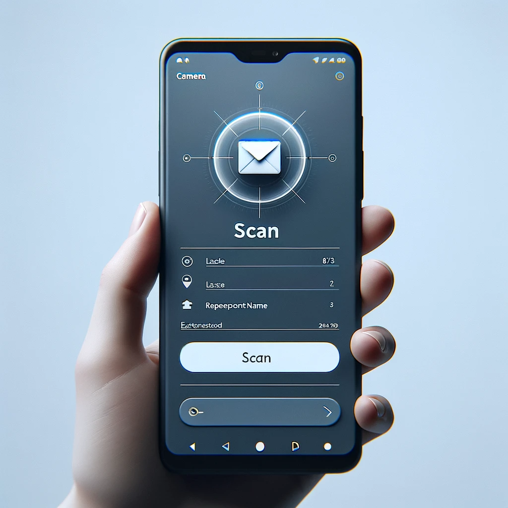

# MailScan - Blazor Server App for Efficient Mail Sorting
[](https://github.com/neozhu/mailscan/actions/workflows/node.js.yml)
## Overview
MailScan is an advanced application, spearheading innovations in mail sorting processes. It leverages state-of-the-art camera scanning and text recognition technologies to significantly improve the efficiency of mail delivery systems. The primary function of MailScan is to meticulously scan envelopes and accurately identify recipient details, thereby enabling sorting personnel to effectively categorize mail based on the recipient's department and office location.

Crafted with the cutting-edge Svelte framework, MailScan excels in performance and offers a user-friendly interface. This makes it an invaluable tool for modern mail handling operations, seamlessly integrating the latest in web technology with practical mail management solutions.


## Features
- **Envelope Scanning**: Utilizes device cameras to capture images of mail envelopes.
- **Text Recognition**: Employs Optical Character Recognition (OCR) to extract recipient information from envelopes.
- **Departmental Sorting**: Determines the corresponding department and office location for each recipient.
- **Efficiency Reports**: Generates reports to track sorting efficiency and identify areas for improvement.

## Getting Started

### Prerequisites
- sveltekit
- PocketBase


## Developing

Once you've created a project and installed dependencies with `npm install` (or `pnpm install` or `yarn`), start a development server:

```bash
npm run dev

# or start the server and open the app in a new browser tab
npm run dev -- --open
```

## Building

To create a production version of your app:

```bash
npm run build
```

You can preview the production build with `npm run preview`.


### Usage
1. Open the app in a web browser.
2. Grant the necessary permissions for the app to access the device camera.
3. Place the envelope under the camera and click the 'Scan' button.
4. View the extracted recipient details and the assigned sorting category.

## How It Works:

1. Scan: The assistant uses their smartphone to scan the letters through the application.
2. OCR Processing: Once the image of the letter is sent to the backend (powered by Python FastAPI service), OCR technology extracts the text.
3. NLP Analysis: The application then performs natural language processing to identify names within the letter.
4. Database Lookup: It uses these names to search a database for the employee's details, including their department and office address.

## Technologies Used
- Type Script
- Docker

## Contributing
Contributions to MailScan are welcome! Please read our [Contributing Guidelines](CONTRIBUTING.md) for more information on how you can contribute to this project.

## License
This project is licensed under the [MIT License](LICENSE).

## Support and Contact
For support, feature requests, or any queries, please [open an issue](https://github.com/neozhu/mailscan/issues) in this repository.


